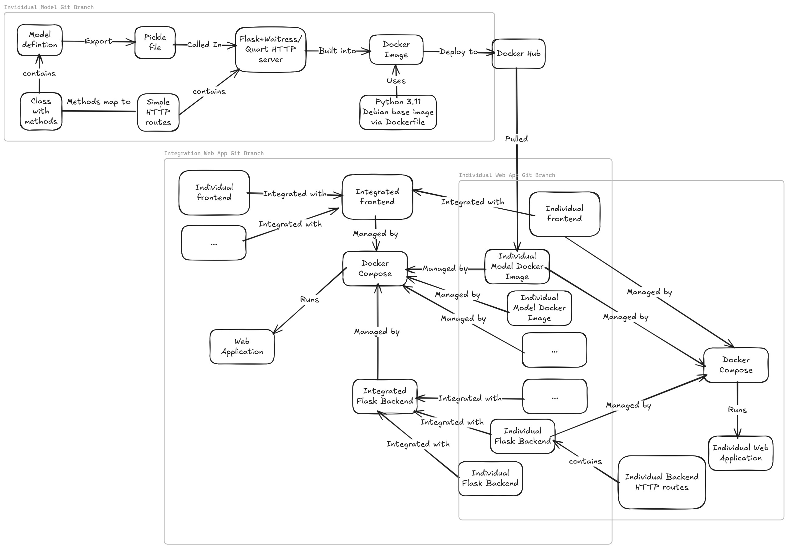
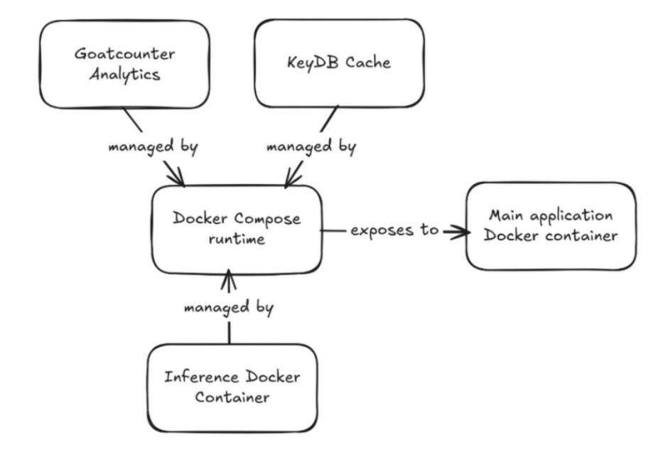

# Note

As sensitive client data was used to trained a group member's code, their
relevant source code was removed from this repository.

Development was done on a separate private repository.

# automo: web app

## high-level software architecture diagram

## Backend service

## Integration: Feature Specification

Attributing feature/lines of code to a specific group member.

## Integration: Who did what

View over at [SPEC.md](./SPEC.md)

The technical specification and summary is collated from all members.

## Technical Specification

- Modular codebase with [Service Oriented Architecture](https://en.wikipedia.org/wiki/Service-oriented_architecture),
following a MVC pattern across a decoupled service architecture
- [Docker Compose](./docker-compose.yml) for managing runtimes
- KeyDB (Redis alternative) cache for CPU intensive routes
- Pandoc with WeasyPrint for markdown to html to PDF conversion for report generation
- SARIMA Forecasting routes
- Interactive Dashboard with various export options (CSV, SVG, JPG)
- Augmented Report Generation using Gemini 2.5 Flash
- Comprehensive [Makefile](./Makefile) for automating repetitive commands
- Integration [Unit tests](./tests/test_api.py): Validated backend service integrity with automated pytest suites and KeyDB latency benchmarks.
- Dynamic LLM Context Management: Parameterized orchestration for the Gemini 2.5 Flash model, allowing for fine-grained control over report generation logic.
- Secure Identity Lifecycle: Complete User CRUD implementation with encrypted persistence and session-based authentication.
- Privacy-Centric Telemetry: Self-hosted GoatCounter integration for real-time traffic observability within a sovereign data perimeter.
- Object Detection of damaged car parts and Generative inpainting to simulate repair
- Reordering recommendation system based on input CSV
- Plotting of graph for model obsolescence with simulation and state snapshot*

Codebase is quite modular with MVC architecture and best practices where possible.

> *This group member's source code is fully excluded as it dealt with sensitive
> client data.
>
> All other group members' code made use of publicly available datasets.

## Summary

Engineered a Decoupled Analytics Pipeline: SARIMA model, backend HTTP routes are isolated and managed with Docker Compose as Distributed Systems.

Implemented Multi-Tier Caching Strategy: KeyDB integration with the benchmark tests, up to 100x speedup (see [Benchmarks section in SPEC](./SPEC.md#benchmarks)), emphasis on Latency Optimization.

Observability and Benchmarking: Benchmarking with `pytest` and `Dockerfile.test` on backend routes and KeyDB performance.

AI-Orchestration Layer: Created a streaming service that aggregates metrics, history and forecasting by the SARIMA model into a streamlined format suitable for reports.

Orchestrated Self-Healing Deployments: Designed a sophisticated Makefile and Docker Compose workflow that automates multi-stage service initialization, including a recursive health-check and auto-provisioning analytics layer, ensuring zero-config environment parity.

## Automation

If you can, make use of the [Makefile](./Makefile) or [`manage.ps1`](./manage.ps1)
> Remember to set ExecutionPolicy to RemoteSigned on Windows
> Note that: manage.ps1 is untested and is provided on a best effort basis
>
> Alternatively, you can run the codebase in a UNIX environment, such as in WSL 2.
>
> - Which can be used with Docker Desktop on Windows

For the best experience, run in *WSL2* or any Linux/MacOS/UNIX derivative.

Dependencies: `conda`, `uv`, `docker`, `docker-compose` with BuildKit, `npm`, Nvidia Container Toolkit.

Note that `make clean` has to be done as non-trivial changes to the backend are
not immediately detected even with the watcher that comes with `make dev`.

## Service Access & Credentials

The infrastructure automatically provisions local service endpoints during the `make dev` or `make up` sequence.

| Service            | Endpoint                                    | Default Credentials          |
|--------------------|---------------------------------------------|------------------------------|
| **Web App** | `http://localhost:8080`                     | User-defined via Register    |
| **Analytics (UI)** | `http://localhost:8081`                     | `admin@example.com` / `admin123` |
| **Model API** | `http://localhost:5000`                     | API Key (See `.env.dev`, make your own copy of `.env` based on it)         |
| **Cache (KeyDB)** | `localhost:6379`                            | N/A (Internal Network)       |

## Supervised Learning Model

Supervised learning is pulled from deployed Docker image, making use of Quart (async Flask) with hypercorn to expose endpoints.

This provides forecasting routes for SARIMA Time Series model.

[Hosted on Docker Hub as `bladeacer/automo-ts`](https://hub.docker.com/r/bladeacer/automo-ts)

## Backend

Backend uses Flask + SQLite + KeyDB (Waitress as WSGI if deployed).

Wraps and calls Supervised Learning Model routes. It also manages auth, cache and data persistence.

> Note: `make watch` might fail sometimes, `make clean` and restart when the server is still outputting old code e.g. import errors.

## Client

The client uses this [Mantine Template](https://github.com/auronvila/mantine-template)
> Which uses React Router and Mantine UI.

This info is relative to the client directory.

- `src/utils/hooks/useAuth.ts` is for handling authentication routes like sign in, logout etc
- `src/configs/routes.config/authRoute.tsx` are where routes that do not require
authentication are defined
- `src/configs/routes.config/route.config.ts` are routes that do require
authentication are defined
- `src/services/auth/auth.service.tsx` are where frontend route calls to the backend
are handled for auth, create your own service under `src/services` where needed
- No 404 page since routing redirects when the target URL is not valid
- For each `@mantine/` library, import styling for it when needed in . E.g. set
`import '@mantine/charts/styles.css'` in `src/App.tsx` when using `@mantine/charts`.
- Refer to `src/services/ForecastService.ts` and `Dashboard.tsx` on how to implement
frontend services for your own routes.
- Implement your own routes in `src/pages`, call in `routes.config.ts`.
- Navigation configuration in `src/configs/navigation.config/index.ts`

## Disclaimer

Made with the assistance of Gemini.
